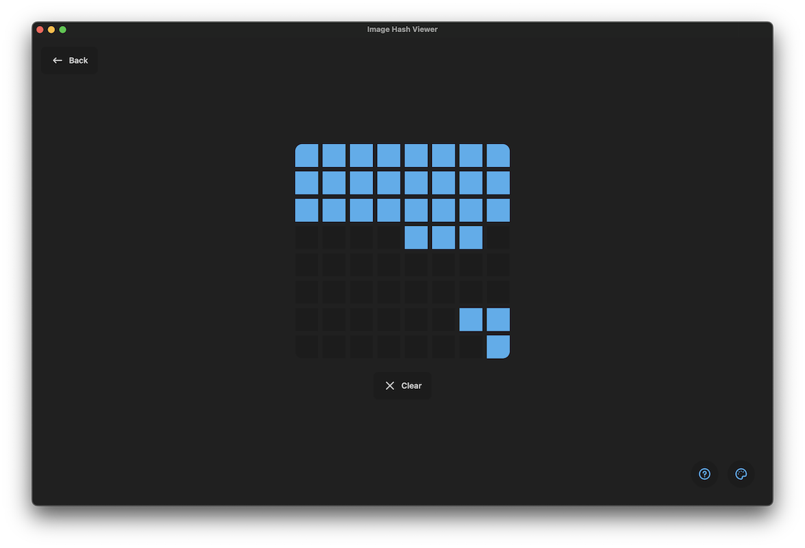

# Image Hash Viewer

- [Image Hash Viewer](#image-hash-viewer)
    - [Decode Hashes](#decode-hashes)
    - [Generating Hashes](#generating-hashes)
  - [Installation](#installation)
      - [A Note on Updating](#a-note-on-updating)

Image Hash Viewer is a cross-platform UI application that helps to work with various image hashes like Average Hash, Difference Hash or Perceptual Hash powered by [`imghash-rs`](https://github.com/YannickAlex07/imghash-rs). Out of the box it comes with the following features:

* Decode a hash to its original bit matrix
* Generate the various hashes for an image

### Decode Hashes

Decoding hashes allows you to reverse a hash to its original bit matrix. If you wanna learn more about the algorithm behind that, give the [imghash-rs documentation](https://github.com/YannickAlex07/imghash-rs/blob/main/docs/encoding.md) a read.

### Generating Hashes

You can generate hashes for various different image hashing algorithms, including:

* `Average Hash`
* `Difference Hash`
* `Perceptual Hash`

## Installation

Currently the installation happens by downloading the appropiate installer from the GitHub Release page.

Here is a map which installer to use for which platform:

| Platform              | Installer                                                                                |
| --------------------- | ---------------------------------------------------------------------------------------- |
| MacOS (Apple Silicon) | `img-hash-viewer_X.X.X_aarch64.dmg`                                                      |
| MacOS (Intel)         | `img-hash-viewer_X.X.X_x64.dmg`                                                          |
| Windows               | 
`img-hash-viewer_X.X.X_x64-setup.exe`

`img-hash-viewer_X.X.X_x64_en-US.msi`
 |
| Linux                 | 
`img-hash-viewer_X.X.X_amd64.AppImage`

`img-hash-viewer_X.X.X_amd64.deb`
    |

Download the appropiate installer from the latest release and follow the instructions of the installer.

#### A Note on Updating

Currently the app does **not** support auto updating, however this is a feature planned for the future. Until then, it is required to manually download the newest app and install it over the current one you have installed.
